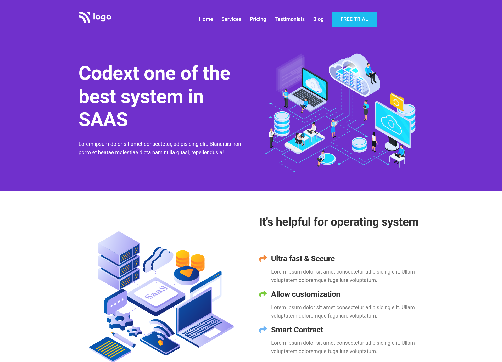

# PROJECT 13 - Sass landing page

This is the thirteenth project among the 15 Ineuron-projects.

## Table of contents

- [Overview](#overview)
  - [Screenshot](#screenshot)
  - [Links](#links)
- [My process](#my-process)
  - [Built with](#built-with)
  - [Time required](#time-required)
  - [What I learned](#continues-development)
  - [Useful resources](#useful-resources)
- [Author](#author)
- [Acknowledgments](#acknowledgments)

## Overview

### Screenshot




### Links

- Code File URL: [github.com](https://github.com/Jyotimoykathar/Project-13)
- Live Site URL: [netlify.app](https://project-13-sass-landing.netlify.app/)

## My process

### Built with

- Semantic HTML5 markup
- CSS custom properties
- Flexbox Css
- Media queries

### Time required

Nearly 4 day required to complete and also get the desired responsiveness of the page.

### What I learned

This is the css design code snippet of the media querie at 704px.

```css
/* below 704px(Tablets) */
/* 704px/16 = 44 */
@media (max-width: 44em) {
  .heading-primary {
    font-size: 4.4rem;
  }
  .heading-secondary {
    font-size: 3rem;
    margin-bottom: 3.2rem;
  }
  .heading-tertiary {
    font-size: 2rem;
  }
  .description {
    font-size: 1.4rem;
    line-height: 1;
  }
  .icon-mobile-nav {
    font-size: 3.6rem;
  }
}
```

### Continued development

I still have a lot to improve on grid and media queries section.

### Useful resources

- [MDN](https://developer.mozilla.org/en-US/) - This website helped me to any thing i had to look upon.

## Author

- Github page- [Jyotimoykathar](https://github.com/Jyotimoykathar/)

## Acknowledgments

Special Thanks to Ineuron team for the project to test and improve my CSS grid and media querie skills.
